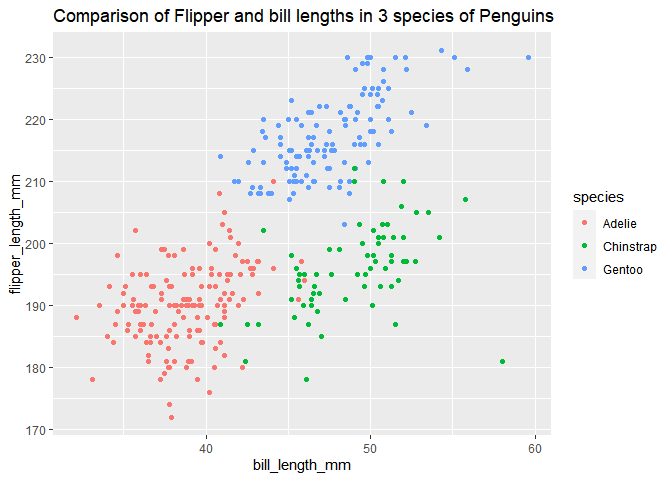

HomeWork 1
================
Wuraola Olawole
9/15/2020

## Problem 1

### a. Create Data frame

``` r
library(tidyverse)

  music_df =
    
    tibble(
      
      music_num = rnorm(10),
              
      music_logical = music_num > 0,
              
      music_char = c("doh", "reh", "mi", "fah","soh", "lah", "ti", "d#", "r#", "f#" ),
              
      music_factor = factor(c("low", "low", "low", "mod", "mod", "mod", "high", "high", "high", "high"))
)
```

### b. Mean of each variable in music\_df

``` r
  mean(pull(music_df, music_num))
```

    ## [1] -0.3420611

``` r
  mean(pull(music_df, music_logical))
```

    ## [1] 0.4

``` r
  mean(pull(music_df, music_char))
```

    ## [1] NA

``` r
  mean(pull(music_df, music_factor))
```

    ## [1] NA

I can’t take the mean of the Character and factor variables

Only the means of numerical and logical variables can be taken

### c. Use as.numeric function

``` r
  as.numeric(pull(music_df, music_logical))
  
  as.numeric(pull(music_df, music_char))
  
  as.numeric(pull(music_df, music_factor))
```

I am able to convert the logical and factor variables to numeric values

However, I Was unable to convert the character variables to numeric
values directly

### d. Convert music\_logical to Num and factor

``` r
  as.numeric(pull(music_df, music_logical)) * pull(music_df, music_num)
```

    ##  [1] 0.0000000 0.0000000 0.1654977 0.0000000 0.4668571 0.2891598 0.0000000
    ##  [8] 0.3779802 0.0000000 0.0000000

``` r
  as.factor(pull(music_df, music_logical)) * pull(music_df, music_num)
```

    ##  [1] NA NA NA NA NA NA NA NA NA NA

``` r
  as.numeric(as.factor(pull(music_df, music_logical))) * pull(music_df, music_num)
```

    ##  [1] -1.3495895 -0.6295702  0.3309955 -0.1677358  0.9337141  0.5783195
    ##  [7] -1.1818835  0.7559605 -0.2773244 -1.1140023

## Problem 2

### a. Install palmerpenguins and describe data set

``` r
  data("penguins", package = "palmerpenguins")
```

This data set contains the species, island, bill\_length\_mm,
bill\_depth\_mm, flipper\_length\_mm, body\_mass\_g, sex, year (of data
collection) of 344 penguins.

The 3 species used in this data set were: Adelie, Chinstrap, Gentoo and
they were 152, 68, 124 respectively. The average body mass in grams of
these penguins was 4201.75, the average bill length in mm of these
penguins was 43.92, the average bill depth in mm of these penguins was
17.15, and the average flipper length in mm of these penguins was
200.92. In this data set there were 344 rows and 8 columns.

### b. Plot flipper length against bill length

``` r
  ggplot(
    
    penguins, 
    
    aes(x = bill_length_mm, y = flipper_length_mm, color = species)) + 
    
  geom_point(shape = 16) + ggtitle("Comparison of Flipper and bill lengths in 3 species of Penguins")
```

<!-- -->

``` r
  ggsave("penguins.pdf")
```

    ## Saving 7 x 5 in image
